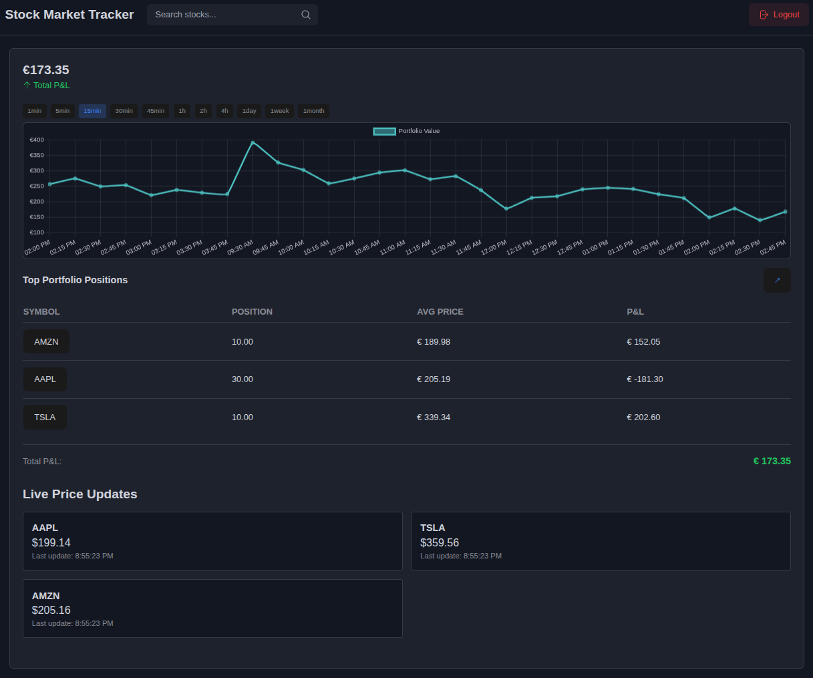
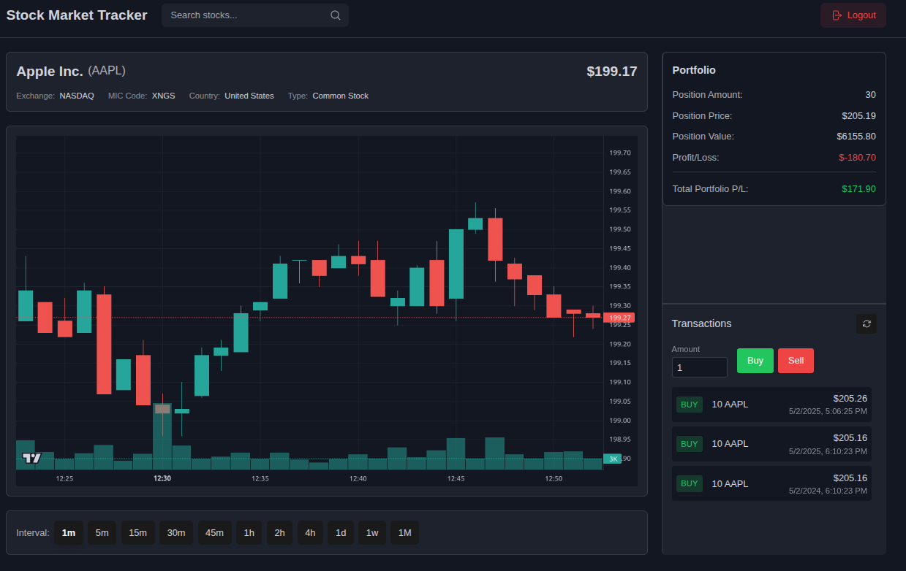

# Implementation of Reactive Patterns in Microservices Architecture: Stock Market Tracker

## Introduction

In the era of digital transformation, the demand for scalable, responsive, and resilient software systems is greater than ever. Financial applications, such as stock market trackers, require the ability to process and deliver real-time data to users while maintaining high availability and efficient resource utilization. Traditional monolithic and synchronous architectures often struggle to meet these requirements, especially under high load or when integrating with multiple external data sources.

This bachelor thesis explores the application of **reactive programming** within a **microservices architecture** by developing a real-world stock market tracking application. The project demonstrates how reactive patterns—implemented using **Project Reactor** and **Spring WebFlux**—can address the challenges of modern distributed systems, particularly in the context of real-time financial data processing.

## Motivation and Problem Statement

The stock market is a dynamic environment where prices and portfolio values change rapidly. Users expect instant updates, seamless user experience, and robust error handling. However, integrating multiple data sources, handling concurrent user requests, and ensuring system responsiveness can be challenging with traditional programming models.

**Reactive programming** offers a paradigm shift by enabling asynchronous, non-blocking, and event-driven processing. When combined with a **microservices architecture**, it allows for the decomposition of complex systems into independently deployable, scalable, and maintainable services.

## Research Objectives

The main objectives of this thesis are:
- To investigate the benefits and challenges of reactive programming in microservices-based systems.
- To design and implement a stock market tracker using reactive patterns and microservices.
- To evaluate the system's responsiveness, scalability, and resource efficiency.
- To document best practices and lessons learned for future research and development.

## Methodology

The research is conducted through the practical implementation of a stock market tracking application, which includes:
- Designing a microservices architecture with clear service boundaries.
- Implementing reactive REST APIs and WebSocket endpoints using Spring WebFlux and Project Reactor.
- Integrating external financial data providers for real-time stock prices.
- Developing a modern frontend with React and WebSocket clients for live updates.
- Containerizing all services and orchestrating them with Docker Compose.
- Measuring and analyzing system performance under various load scenarios.

## System Overview

The Stock Market Tracker consists of the following microservices:

1. **Authentication Service**  
   Handles user registration, login, and JWT-based authentication.

2. **Stock Service**  
   Provides real-time and historical stock data, including a reactive WebSocket for live price updates.

3. **Portfolio Service**  
   Enables users to manage their stock portfolios, track positions, and view historical performance.

Each service is developed using reactive programming principles, ensuring non-blocking I/O, efficient resource usage, and high scalability.

---

## Application Screenshots

### Dashboard



### Stock Details



## Key Concepts: Mono and Flux

- **Mono**: Represents a stream of 0 or 1 element. Used for single-result operations, such as fetching a user profile or a stock's current price.
  ```java
  Mono<StockInfo> getStockInfo(String symbol) { ... }
  ```
- **Flux**: Represents a stream of 0 to N elements. Used for multiple results or continuous data, such as streaming price updates.
  ```java
  Flux<PriceUpdate> streamPriceUpdates(String symbol) { ... }
  ```

## Why Reactive Microservices?

- **Responsiveness**: Users receive updates instantly, even under heavy load.
- **Scalability**: The system can handle thousands of concurrent connections with minimal threads.
- **Resilience**: Failures in one service do not cascade, and errors are handled gracefully.
- **Resource Efficiency**: Non-blocking I/O and backpressure management prevent resource exhaustion.

## Structure of the Thesis

1. **Theoretical Background**: Introduction to reactive programming and microservices.
2. **System Design**: Architectural decisions, service boundaries, and technology stack.
3. **Implementation**: Code examples, API design, and integration patterns.
4. **Evaluation**: Performance benchmarks and analysis.
5. **Conclusion**: Key findings, challenges, and future work.

## Conclusion

This project serves as a practical demonstration of how reactive programming and microservices can be combined to build modern, high-performance applications. The Stock Market Tracker not only meets the technical requirements of real-time financial systems but also provides a foundation for further research and development in the field of reactive distributed systems. 